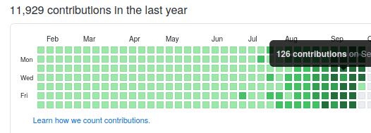

# DataDrivenPerformanceManagement #

Greetings RockStar developer! As you know, ***data*** is the paradigm of the future. Therefore - to best capture the dynamic
strategic synergies implied by this shift:

* Commit Velocity, as an objective metric, shall be the basis for your ongoing performance assessment.

To set clear expectations - here's the kind of value we're looking for in senior talent like you:



## Participate in Evaluation
Step 1: Create a GitHub repo to aid in your assessment.

Step 2: Demonstrate your growth potential: 
```
git checkout git@github.com:tmwilder/DataDrivenPerformanceManagement.git
cd DataDrivenPerformanceManagement
./demonstrate_growth_potential.sh
cd synergisticvelocity
git remote add upstream git@github.com:yourgithubhandle/synergisticvelocity.git
git push upstream main
```

## Next Steps
* Stand by - [your KPI will be evaluated shortly](https://docs.github.com/en/github/setting-up-and-managing-your-github-profile/why-are-my-contributions-not-showing-up-on-my-profile#commit-was-made-less-than-24-hours-ago).
* To ensure excellence - KPI shall be evaluated on a stack ranked basis.
* We appreciate your cooperation!
